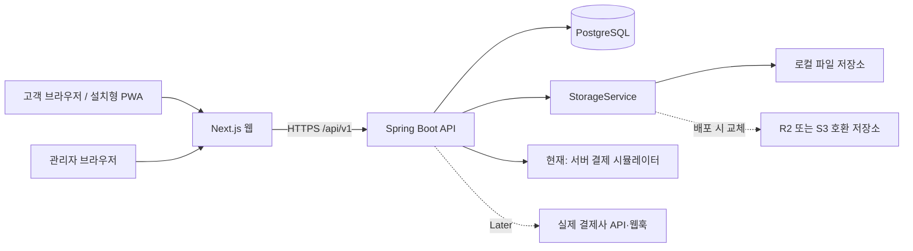

# 시스템 아키텍처

## 1. 문서 목적과 현재 결정

이 문서는 프로토타입 이후에도 같은 코드베이스를 유지·확장하기 위한 기술 경계와 운영 원칙을 정의한다. 구현 과정에서 배포 환경이 바뀌더라도 애플리케이션 구조가 특정 호스팅 사업자에 종속되지 않도록 한다.

현재 확정된 기술 구성은 다음과 같다.

| 영역 | 기술 | 책임 |
|---|---|---|
| 고객·관리자 웹 | Next.js, TypeScript | 화면 렌더링, 사용자 입력, Spring API 호출 |
| 백엔드 API | Java, Spring Boot | 인증·인가, 업무 규칙, 트랜잭션, 외부 서비스 연동 |
| 관계형 DB | PostgreSQL | 회원, 상품, 장바구니, 주문, 결제 데이터의 영속화 |
| 이미지 저장소 | `StorageService` 구현체 | 현재 로컬 파일 조회, 이후 업로드 가능한 R2/S3 구현으로 교체 |
| 시연 배포 후보 | AWS EC2 `t3a.medium`, Docker Compose | Nginx HTTPS 아래 Next.js·Spring Boot·PostgreSQL을 단일 호스트에서 격리 실행 |

2026-08-15 현재 저트래픽 포트폴리오 시연 환경은 기존 EC2 한 대를 `t3a.medium`으로 변경해 Docker Compose로 운영하는 안을 선택했다. 이는 실제 판매 운영 확정안이 아니라 stage 배포 후보이며, 외부 HTTPS·백업 복구·자원 사용량을 검증한 뒤 유지 여부를 확정한다.

### 2026-08-13 구현 체크포인트

- Next.js 고객·관리자 화면과 Spring Boot `/api/v1`, PostgreSQL V1~V6가 연결돼 있다.
- Spring Session JDBC, `CUSTOMER`/`ADMIN` 권한, 32바이트 방문자 쿠키의 SHA-256 해시 저장, 고객 로그인 시 방문자 장바구니 병합을 구현했다. 찜은 `CUSTOMER` 전용이며 관리자 로그인은 방문자 데이터를 병합하거나 소비하지 않는다.
- 주문 생성은 서버 가격 재계산, 멱등성 키, 주문 스냅샷, 20분 재고 예약을 사용한다. 동일 장바구니 행은 주문 생성 중 잠그고 한 주문에서만 소비하며, 결제 승인·실패·만료는 한 번만 재고를 확정 또는 복원한다. 만료 결제의 같은 멱등성 키 재시도도 계속 `409 ORDER_RESERVATION_EXPIRED`다.
- 결제는 시연용 `SIMULATED` provider만 구현했다. 실제 PG 승인·조회·취소, 웹훅과 조회 실패 레이트리밋은 아직 없다.
- 관리자 API는 상품·옵션·재고·상태, 주문·상태 전이, 홈 섹션·히어로, 회원 목록 조회까지 구현했다. 상품 전체 수정과 옵션 재고 수정은 각 행의 `version`으로 낙관적 잠금을 적용하고, 홈 JSON은 섹션별 스키마를 검증한다. 이미지 파일 업로드, 기획전·분류 CRUD, 회원 상세는 Later다.

## 2. 전체 구조



웹은 DB, 결제사, 파일 저장소에 직접 접근하지 않는다. 모든 중요 상태 변경과 가격·재고 검증은 Spring Boot API를 통과해야 한다.

## 3. 애플리케이션 경계

### 3.1 Next.js 웹

Next.js는 고객 쇼핑몰과 관리자 화면을 제공한다.

- 상품·기획전·콘텐츠 화면 렌더링
- 회원가입·로그인·배송지·주문서 폼
- 찜, 장바구니, 주문, 결제 화면 상태 관리
- 관리자 상품·재고·기획전·주문 관리 UI
- Spring Boot의 `/api/v1` 호출과 오류·로딩 처리
- 모바일 우선 반응형 UI 및 PWA 기반 구성

Next.js에 주문 금액 확정, 재고 차감, 결제 승인, 관리자 권한 판정 같은 업무 규칙을 두지 않는다. 화면에 보이는 가격은 참고 값이며 최종 금액은 API가 DB 기준으로 다시 계산한다.

### 3.2 Spring Boot API

백엔드는 처음부터 마이크로서비스로 나누지 않고 **모듈러 모놀리스**로 시작한다. 한 프로세스로 배포하되 패키지와 의존 방향을 다음 업무 영역별로 분리한다.

| 모듈 | 주요 책임 |
|---|---|
| `identity` | 회원가입, 로그인·로그아웃, 현재 사용자, 권한, 방문자 식별 |
| `catalog` | 상품, 옵션, 브랜드, 카테고리, 동물 종, 이미지 |
| `merchandising` | 기획전, 홈 섹션, 노출 순서 |
| `cart` | 회원·비회원 장바구니, 회원 전용 찜, 로그인 시 장바구니 병합 |
| `order` | 주문 생성, 주문 스냅샷, 상태 전이, 주문 조회 |
| `payment` | 현재 시뮬레이션 결제 승인·실패, 멱등성, 예약 만료·재고 복원. 실PG·웹훅은 Later |
| `admin` | 관리자 전용 API, 변경 이력 |
| `storage` | 파일 저장소 추상화와 구현체 선택 |

모듈 간 호출은 공개된 애플리케이션 서비스에 한정한다. 다른 모듈의 저장소(repository)를 직접 호출하거나 테이블을 임의로 갱신하지 않는다. 컨트롤러는 요청 검증과 응답 변환에 집중하고, 트랜잭션과 업무 규칙은 애플리케이션 서비스에 둔다.

API는 `/api/v1`로 버전을 고정하고 현재는 `08_API_CONTRACT.md`와 DTO·통합 테스트를 함께 유지한다. 자동 생성 OpenAPI/Swagger는 Later이며, 향후 모바일 앱은 같은 API 계약을 사용한다.

### 3.3 PostgreSQL

PostgreSQL은 Spring Boot만 접근한다. 핵심 데이터는 관계형 컬럼으로 모델링하고, 상품별 비정형 부가 속성처럼 실제로 유동적인 값에만 `jsonb`를 제한적으로 사용한다.

- 주문·결제 금액은 원 단위 정수로 저장한다.
- 외래키와 고유 제약조건으로 데이터 무결성을 보장한다.
- 비밀번호, 세션 원문, 비회원 조회 토큰 원문은 저장하지 않는다. 비회원 조회 토큰은 배포 비밀을 사용한 HMAC-SHA256으로 결정적으로 생성하고 DB에는 다시 SHA-256 해시한 값만 저장한다.
- 상품 수정과 무관하게 과거 주문이 보존되도록 주문 당시 정보를 스냅샷으로 저장한다.

세부 테이블과 규칙은 `docs/04_DATABASE.md`에서 정의한다.

## 4. 로컬 개발 구성

| 서비스 | 기본 주소 | 비고 |
|---|---|---|
| Next.js | `http://localhost:3000` | 고객·관리자 웹 |
| Spring Boot | `http://localhost:8080` | `/api/v1`, OpenAPI |
| PostgreSQL | `localhost:5432` | 외부 공개 금지 |

개발 환경에서는 두 오리진을 사용하므로 Spring CORS 설정에 `http://localhost:3000`만 명시적으로 허용한다. 와일드카드(`*`)와 자격 증명 허용을 함께 사용하지 않는다.

운영 환경에서는 가능하면 리버스 프록시를 사용해 다음처럼 **동일 오리진**으로 제공한다.

```text
https://shop.example.com/        -> Next.js
https://shop.example.com/api/v1/ -> Spring Boot
https://shop.example.com/media/  -> Spring Boot StorageService
```

동일 오리진 구성은 쿠키, CORS, CSRF, 브라우저 추적 방지 정책에 따른 문제를 줄인다. 프론트와 API를 서로 다른 도메인으로 배포해야 한다면 다음을 모두 명시적으로 구성한다.

- 허용 origin을 실제 웹 도메인으로 제한
- 프론트 요청에 `credentials: "include"` 적용
- 서버의 credential 허용 및 정확한 CORS 응답 헤더
- 쿠키 `SameSite=None; Secure` 필요 여부 검토
- 운영·스테이징 도메인을 별도 허용 목록으로 관리

### 4.1 EC2 stage 배포 후보

단일 `t3a.medium`의 stage 구성은 다음과 같다.

```text
Internet :80/:443
        -> Nginx (대표 도메인 TLS 종료, 별칭 301 이동, 기본 보안 헤더, 공개 인증 API 속도 제한)
           ├─ /        -> Next.js standalone :3000
           ├─ /api/**  -> Spring Boot stage :8080
           └─ /media/**-> Spring Boot stage :8080
Spring Boot -> PostgreSQL :5432
```

- 외부에는 80·443만 공개하고 3000·8080·5432는 Compose 내부 네트워크에만 둔다.
- SSH 22는 관리자 현재 공인 IP `/32`로 제한한다.
- PostgreSQL과 TLS 인증서는 named volume, 데모 미디어는 전용 경로의 읽기 전용 bind mount를 사용한다.
- stage는 시뮬레이션 결제임을 명시하며 `local` 프로필과 공개된 데모 회원·관리자 seed를 사용하지 않는다.
- 새 DB에는 Flyway 적용 후 가상 카탈로그·머천다이징 데이터만 수동 적재한다. 관리자는 강한 비밀번호로 직접 가입한 뒤 일회성 역할 변경으로 만든다.
- 컨테이너 메모리 상한과 로그 회전을 적용하고, 빌드는 4GiB 호스트의 자원 경합을 줄이기 위해 백엔드와 프론트를 순차 실행한다.
- 대표 주소는 `zabre-mall.com` 하나로 고정하고 `www.zabre-mall.com`과 이전 주소 `mall.cozysignal.com`은 경로·쿼리를 보존해 301로 이동한다. 프론트 API 기준 주소와 CORS도 대표 주소만 사용한다.
- 실제 실행·인증서·백업 절차는 `docs/10_EC2_DEPLOYMENT_RUNBOOK.md`를 따른다.

## 5. 인증·인가와 쿠키

웹 MVP는 Spring Security의 서버 세션 인증을 기본으로 사용한다.

- 비밀번호는 Spring `PasswordEncoder`로 단방향 해시한다.
- 인증 쿠키는 `HttpOnly`를 적용해 JavaScript에서 읽을 수 없게 한다.
- 운영 HTTPS에서는 `Secure`를 적용한다.
- 동일 사이트 배포를 기준으로 `SameSite=Lax`를 기본값으로 검토한다.
- 로그인 성공 시 세션 ID를 교체해 세션 고정 공격을 방지한다.
- 상태 변경 요청에는 Spring Security CSRF 방어를 유지한다.
- API는 URL을 숨기는 방식이 아니라 서버 측 권한 검사로 보호한다.
- 초기 권한은 `CUSTOMER`, `ADMIN`으로 시작한다.
- 회원가입·로그인 이메일 입력은 최대 100자로 제한한다.
- 로그인 후 `next` 이동은 같은 출처의 내부 경로만 허용하며, 이중 슬래시와 원문·인코딩된 역슬래시가 포함된 경로는 홈으로 대체한다.

비회원 브라우저에는 별도의 무작위 방문자 토큰 쿠키를 발급한다. DB에는 토큰 원문이 아닌 해시만 저장한다. 이 토큰은 장바구니 소유권 식별용이며 로그인 인증 수단이나 비회원 주문 조회 비밀번호로 재사용하지 않는다.

현재 방문자 토큰은 32바이트 보안 난수로 생성하고 `PET_VISITOR` HttpOnly 쿠키에 보관하며 PostgreSQL에는 SHA-256 해시만 저장한다.

비회원 주문 조회 토큰은 방문자 쿠키와 별개다. 32바이트 이상의 배포별 비밀, 주문번호, 주문 멱등성 키와 요청 해시를 HMAC-SHA256으로 결합해 생성하므로 같은 주문 생성 요청의 첫 응답과 멱등 재응답에서 동일한 원문을 다시 제공할 수 있다. stage/prod는 `GUEST_LOOKUP_TOKEN_SECRET`이 없으면 기동하지 않으며, 기존 주문의 재생 가능성을 위해 배포 중 값을 안정적으로 유지한다.

웹 MVP는 PostgreSQL을 사용하는 Spring Session JDBC로 세션을 저장한다. 프로세스 재시작 뒤에도 세션 저장 방식이 일관되고 향후 API 인스턴스를 늘릴 때 인증 구조를 바꾸지 않아도 된다. Redis는 실제 성능·운영 필요가 확인될 때만 도입한다. 향후 네이티브 앱 인증은 별도 토큰 방식을 추가하되, 웹 MVP 때문에 미리 JWT 구조를 도입하지 않는다.

## 6. 회원·비회원 흐름의 책임

- 비회원도 방문자 쿠키를 기준으로 장바구니를 사용할 수 있다. 찜 API는 `CUSTOMER` 역할에만 허용한다.
- 기존 `CUSTOMER` 로그인 완료 시에만 비회원 장바구니를 회원 장바구니에 서버 트랜잭션으로 병합한다. 신규 회원가입은 새 계정을 빈 장바구니·빈 찜으로 시작하고 기존 방문자 활성 장바구니는 `EXPIRED`, 과거 방문자 찜은 삭제한다. 관리자 로그인과 관리자 명시적 병합 요청은 방문자 장바구니를 소비하지 않는다.
- 비회원 주문은 `user_id` 없이 생성하며 별도의 안전한 조회 토큰을 사용한다.
- 회원 주문과 비회원 주문은 같은 주문 모델과 결제 흐름을 사용한다.
- 이메일이나 전화번호가 같다는 이유만으로 과거 비회원 주문을 회원에게 자동 귀속하지 않는다.

병합 규칙, 주문 스냅샷, 결제 멱등성은 DB 문서에서 구체화한다.

주문 생성은 선택한 장바구니 행을 정렬해 `FOR UPDATE`로 잠그고 삭제 영향 행 수를 확인한다. V6의 `order_items(cart_item_id)` 부분 고유 인덱스가 같은 장바구니 행의 이중 주문을 DB에서도 차단한다. 재고 예약 만료는 Spring 스케줄러가 `FOR UPDATE SKIP LOCKED`로 작은 묶음을 잠그고 처리하며, 결제 확인과 만료가 경쟁해도 예약 상태가 `ACTIVE`인 쪽만 재고를 변경한다.

## 7. 파일 저장소 추상화

백엔드 업무 코드가 특정 클라우드 SDK에 의존하지 않도록 `StorageService` 경계를 둔다. 현재 인터페이스는 공개 미디어 조회만 제공한다.

```text
StorageService
└─ find(storageKey) -> 저장된 미디어 메타데이터와 읽기 리소스
```

구현체는 환경에 따라 선택한다.

- `FileSystemStorageService`: local/test 파일 조회용, 현재 구현
- 업로드·삭제와 `R2StorageService`/`S3StorageService`: 배포 저장소를 정한 뒤 추가

DB에는 운영체제 파일 경로나 일회성 서명 URL이 아니라 안정적인 `storage_key`를 저장한다. 업로드 시 확장자만 믿지 않고 MIME 유형, 파일 크기, 허용 이미지 형식을 서버에서 검증하며, 파일명은 서버가 생성한다. 상품 삭제와 이미지 물리 삭제는 분리해 참조 중인 파일이 사라지지 않게 한다.

## 8. 환경 설정과 비밀정보

Spring 프로필은 다음처럼 분리한다.

| 프로필 | 목적 |
|---|---|
| `local` | 로컬 PostgreSQL, 로컬 파일 저장소, 시뮬레이션 결제, 데모 seed |
| `stage` | 사업자 시연·통합 테스트 환경 |
| `prod` | 실제 운영 환경 |

공통 설정은 `application.yml`, 환경별 차이는 `application-local.yml`, `application-stage.yml`, `application-prod.yml`에 둔다. 기본 프로필을 `local`로 강제하지 않으며 개발 스크립트가 명시적으로 `local`을 선택한다. local/test만 `db/seed`를 포함하고 stage/prod는 기본적으로 스키마 마이그레이션만 적용한다. 시뮬레이터는 공통·prod 기본값이 `false`, local/test는 `true`, stage는 현재 시연 목적상 `SIMULATED_PAYMENT_ENABLED` 기본값이 `true`다. stage를 운영으로 승격하지 말고 실제 운영 프로필에서는 반드시 비활성화한다. stage/prod에서는 세션·방문자·CSRF 쿠키를 모두 `Secure`로 발급한다. stage/prod의 `GUEST_LOOKUP_TOKEN_SECRET`은 32바이트 이상의 배포 secret으로 필수 주입하고 미설정 시 fail-fast한다. DB 비밀번호, 세션 키, 결제 비밀키, 조회 토큰 비밀, 스토리지 자격 증명은 파일이나 Git에 저장하지 않는다.

프론트의 공개 가능한 API 기준 URL만 `NEXT_PUBLIC_*`로 노출한다. 결제 비밀키나 DB 접속 정보에는 절대 이 접두사를 사용하지 않는다.

## 9. DB 마이그레이션

스키마 변경은 Flyway로만 관리한다.

- 로컬에서도 `ddl-auto=update`를 사용하지 않는다.
- JPA의 스키마 설정은 `validate`를 기본으로 한다.
- 적용된 마이그레이션 파일은 수정하지 않고 새 버전을 추가한다.
- 파일명은 `V1__create_identity.sql`, `V2__create_catalog.sql`처럼 의도를 드러낸다.
- 파괴적 변경은 데이터 이전, 애플리케이션 호환, 컬럼 제거를 단계로 나눈다.
- 스테이징 백업과 복구 검증 후 운영에 적용한다.

현재 적용된 마이그레이션은 다음과 같다.

```text
V1__create_identity.sql
V2__create_catalog.sql
V3__create_merchandising.sql
V4__create_cart_and_wishlist.sql
V5__create_orders_and_payments.sql
V6__harden_commerce_integrity.sql
```

`V5`에는 주문, 주문 상품 스냅샷, 재고 예약, 결제, 결제 멱등 기록, 주문 상태 이력, 결제 이벤트 골격, 관리자 감사 로그가 포함된다. 결제 이벤트 테이블은 실PG 웹훅 구현 전의 스키마 경계이며 아직 공개 웹훅 API는 없다.

`V6`는 `order_items.cart_item_id`가 null이 아닐 때만 적용되는 부분 고유 인덱스를 추가해 동일 장바구니 행이 서로 다른 주문에 중복 사용되지 않도록 보강한다.

## 10. EC2 stage 배포 검증 항목

배포 전에는 보유 서버를 읽기 전용으로 점검하고, 다음 정보를 확인한 뒤에만 변경한다.

- 운영체제, CPU, 메모리, 디스크 여유
- 설치된 Java, Docker, PostgreSQL/MySQL 버전
- 실행 중인 프로세스·컨테이너와 사용 포트
- Nginx/Apache, 도메인, HTTPS 인증서 구성
- 방화벽 및 외부 접근 정책
- 기존 서비스의 중요도와 배포 담당자
- DB·파일 백업 및 복구 방법

점검 전에는 기존 프로세스, 포트, 방화벽, DB를 변경하지 않는다. 대상 서버의 용도와 변경 승인을 확인한 뒤 스냅샷, 인스턴스 유형 변경, EIP·DNS, 보안 그룹, Docker 설치 순으로 진행한다. 스테이징에서 회원가입부터 결제 완료까지 전체 흐름, 재시작 후 DB·미디어 유지, 백업 파일 생성과 복구 절차를 검증한 후 시연 링크를 확정한다.

## 11. 구현 시 지켜야 할 불변 원칙

1. 프론트는 DB나 결제 비밀키에 직접 접근하지 않는다.
2. 가격, 할인, 배송비, 재고, 권한은 백엔드가 다시 검증한다.
3. 주문과 결제 상태는 정의된 상태 전이만 허용한다.
4. 동일 결제 요청이나 웹훅이 반복돼도 중복 승인·중복 처리가 발생하지 않게 한다.
5. 회원·비회원 주문 모두 주문 당시 상품·구매자·배송 정보를 보존한다.
6. 배포 환경이나 파일 저장소 변경이 핵심 업무 코드 변경으로 이어지지 않게 한다.
7. API 계약과 Flyway 이력을 코드와 함께 버전 관리한다.
