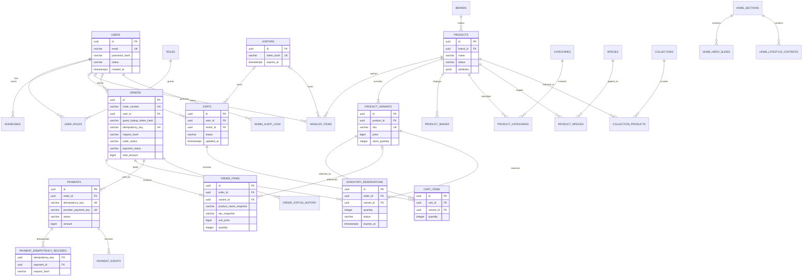

# 데이터베이스 설계

## 1. 설계 목표

PostgreSQL을 기준으로 회원·비회원 구매, 방문자 장바구니 병합, 회원 찜, 상품 옵션, 주문 스냅샷, 결제 중복 방지를 지원한다. 초기에는 단일 DB를 사용하되 서비스가 성장해도 업무 경계를 유지할 수 있도록 테이블 책임을 분리한다.

주요 원칙은 다음과 같다.

- 회원 주문과 비회원 주문을 하나의 `orders` 모델로 처리한다.
- 장바구니 가격을 신뢰하지 않고 주문 생성 시 상품·옵션 가격을 다시 조회한다.
- 과거 주문은 상품이나 회원 정보가 바뀌어도 변하지 않는다.
- 결제 승인과 웹훅은 여러 번 수신될 수 있다고 가정한다.
- 공개 URL에 순차 증가 PK를 노출하지 않고 별도의 주문번호나 무작위 식별자를 사용한다.
- 원화 금액은 부동소수점이 아닌 `bigint` 또는 `numeric(19,0)` 정수로 저장한다.
- 모든 시간은 `timestamptz`로 저장하고 화면에서 한국 시간으로 변환한다.

### 2026-08-13 구현 체크포인트

- V1~V6와 local/test 반복 seed가 구현돼 있다.
- 데모 카탈로그는 상품 24개와 옵션 26개이며, 회원·관리자 계정과 승인 회원 주문·실패 비회원 주문 예시를 포함한다.
- 주문 생성·결제 확인은 각각 요청 해시와 멱등성 키를 기록한다. 동일 장바구니 행은 행 잠금과 V6 부분 고유 인덱스로 한 주문에서만 소비하며, 결제 성공은 예약을 `COMMITTED`, 실패는 `RELEASED`, 만료는 `EXPIRED`로 한 번만 전이한다.
- `admin_audit_logs`는 관리자 상품·재고·주문·홈 변경의 수행자와 대상·요약을 기록한다. request ID와 완전한 전후 diff 고도화는 Later다.
- `payment_events`는 실PG 웹훅용 스키마 경계만 존재하고 현재 시뮬레이터 흐름에서는 사용하지 않는다.

## 2. 핵심 ERD



ERD는 핵심 관계를 보여주기 위한 요약이다. 실제 마이그레이션에는 아래 제약조건, 상태값, 감사 컬럼을 함께 반영한다.

## 3. 공통 컬럼과 식별자

업무 테이블은 기본적으로 다음 컬럼을 가진다.

```text
id          uuid primary key
created_at  timestamptz not null
updated_at  timestamptz not null
version     bigint not null default 0   -- 동시 수정 제어가 필요한 테이블
```

UUID는 서버에서 생성한다. 외부 고객에게는 주문 PK 대신 사람이 읽을 수 있으면서 추측하기 어려운 `order_number`를 노출한다. `order_number`는 전역 고유 제약을 둔다.

상품, 회원처럼 운영상 복구 가능성이 필요한 데이터는 즉시 물리 삭제하지 않고 `status`, `deleted_at` 등으로 비활성화한다. 주문·결제·감사 데이터는 일반 관리자 기능에서 물리 삭제하지 않는다.

## 4. 회원과 권한

### `users`

| 컬럼 | 설명 |
|---|---|
| `id` | 회원 UUID |
| `email` | 정규화한 로그인 이메일, 고유 |
| `password_hash` | `PasswordEncoder` 결과 |
| `name`, `phone` | 회원 기본 정보 |
| `status` | `ACTIVE`, `LOCKED`, `WITHDRAWN` |
| `last_login_at` | 최근 로그인 시각 |
| `created_at`, `updated_at` | 감사 시각 |

이메일 비교 규칙을 명확히 정하고 정규화된 값을 고유하게 유지한다. 비밀번호 원문, 복호화 가능한 비밀번호는 저장하지 않는다. 탈퇴하더라도 법적·운영상 보존이 필요한 주문 스냅샷은 함께 삭제하지 않는다.

### `roles`, `user_roles`

초기 역할은 `CUSTOMER`, `ADMIN`이다. 관리자 여부를 `users`의 단순 boolean으로 처리하지 않고 역할 관계로 분리해 향후 CS·상품 운영자 권한을 추가할 수 있게 한다.

### `addresses`

회원이 저장한 배송지다. 주문 생성 시 이 테이블을 참조하더라도 주문에는 당시 값을 복사한다. 저장 배송지 수정이 기존 주문을 바꾸면 안 된다.

### `visitors`

비회원 브라우저의 장바구니 소유자를 나타낸다. 기존 스키마 호환을 위해 방문자 찜 FK는 남아 있지만 애플리케이션은 새 방문자 찜을 만들지 않는다.

- 쿠키에는 충분히 긴 무작위 토큰을 저장한다.
- DB에는 `token_hash`만 저장하고 고유 인덱스를 둔다.
- 만료 시각과 마지막 사용 시각을 두어 정리할 수 있게 한다.
- 로그인 세션, 비회원 주문 조회 토큰과 용도를 분리한다.

## 5. 상품 카탈로그

| 테이블 | 핵심 책임 |
|---|---|
| `brands` | 입점·사입 브랜드 정보 |
| `species` | 강아지, 고양이, 희귀동물 등 확장 가능한 동물 종 |
| `categories` | 계층형 카테고리, 선택적 `parent_id` |
| `products` | 상품 공통 정보, 판매 상태, 설명, 브랜드 |
| `product_variants` | SKU, 옵션 조합, 판매가, 재고 |
| `product_images` | `storage_key`, 대체 텍스트, 노출 순서 |
| `product_categories` | 상품과 카테고리 다대다 관계 |
| `product_species` | 상품과 적용 동물 종 다대다 관계 |
| `collections` | 상황·테마별 기획전 |
| `collection_products` | 기획전 상품과 노출 순서 |

강아지·고양이를 코드 enum이나 상품의 단일 문자열로 고정하지 않는다. `species` 테이블을 사용해야 희귀동물 확장 시 스키마 변경 없이 추가할 수 있다.

`products.attributes jsonb`는 재질, 권장 체중, 케이지 호환 규격처럼 종·카테고리별로 달라지는 보조 속성에만 사용한다. 가격, 재고, SKU, 주문 상태처럼 정합성이 중요한 값은 일반 컬럼과 관계 테이블로 관리한다.

`product_variants`에는 다음 제약을 둔다.

- `sku` 전역 고유
- `price >= 0`
- `stock_quantity >= 0`
- 옵션 조합은 해당 상품 내에서 고유
- 품절·단종 옵션도 기존 주문 참조를 위해 물리 삭제하지 않음

주문 생성의 재고 차감은 조건부 갱신과 트랜잭션으로 보호하고, 관리자 상품 전체 수정·옵션 재고 수정은 각 상품·옵션의 `version` 낙관적 잠금을 사용한다. 오래된 옵션 version이나 다른 상품의 옵션 ID는 `409 OPTIMISTIC_LOCK_CONFLICT`로 거절한다.

## 6. 장바구니와 찜

### `carts`

`carts`는 회원 또는 비회원 방문자 중 정확히 한 소유자만 가진다.

```text
CHECK (
  (user_id IS NOT NULL AND visitor_id IS NULL)
  OR
  (user_id IS NULL AND visitor_id IS NOT NULL)
)
```

상태는 `ACTIVE`, `MERGED`, `ORDERED`, `EXPIRED`로 시작한다. 회원당 활성 장바구니 하나, 방문자당 활성 장바구니 하나만 존재하도록 PostgreSQL 부분 고유 인덱스를 사용한다.

```sql
CREATE UNIQUE INDEX uq_active_cart_user
ON carts (user_id)
WHERE status = 'ACTIVE' AND user_id IS NOT NULL;

CREATE UNIQUE INDEX uq_active_cart_visitor
ON carts (visitor_id)
WHERE status = 'ACTIVE' AND visitor_id IS NOT NULL;
```

### `cart_items`

- `(cart_id, variant_id)` 고유
- `quantity > 0`
- 화면에 표시했던 가격을 캐시할 수는 있지만 주문 금액의 근거로 사용하지 않음
- 장바구니 조회와 주문 생성 시 판매 상태·현재 가격·재고를 다시 확인

### `wishlist_items`

현재 애플리케이션에서는 회원 소유자만 사용하며 회원별 동일 상품 중복을 막는다. V4의 방문자 소유자 컬럼·제약은 기존 로컬 데이터 및 마이그레이션 체크섬 호환을 위해 유지하지만 API에서 방문자 찜은 차단한다. 찜은 상품 단위로 시작하고 옵션 선택은 장바구니에서 처리한다.

### 기존 고객 로그인 시 병합과 신규 가입 격리 규칙

기존 `CUSTOMER` 로그인 시 장바구니 병합은 Spring 서비스의 단일 트랜잭션에서 수행한다.

1. 방문자 활성 장바구니와 회원 활성 장바구니를 잠근다.
2. 같은 옵션이 양쪽에 있으면 수량을 합친다.
3. 합산 수량이 구매 제한이나 현재 재고를 넘으면 허용 수량으로 조정하고 응답에 조정 사실을 포함한다.
4. 회원 장바구니에 결과를 저장한다.
5. 방문자 장바구니는 삭제하지 않고 `MERGED` 상태로 바꾼다.
6. 방문자 찜은 회원에게 병합하지 않고 과거 호환 행이 있으면 정리하며 회원의 기존 찜은 그대로 유지한다.
7. 재요청되어도 같은 결과가 되도록 이미 병합된 상태를 확인한다.
8. `ADMIN` 로그인은 방문자 장바구니를 병합하거나 방문자 활성 카트를 `MERGED`로 소비하지 않는다.

신규 회원가입은 방문자 데이터를 새 계정으로 옮기지 않는다. 가입 성공 트랜잭션에서 해당 방문자의 활성 장바구니를 `EXPIRED`로 바꾸고 과거 방문자 찜 행을 삭제하며, 새 회원의 `cartItemCount`와 `wishlistCount`는 `0`으로 시작한다. 가입이 실패하면 방문자 데이터는 변경하지 않는다.

병합 중 가격은 확정하지 않는다. 주문서 진입과 주문 생성 시 서버가 다시 계산한다.

## 7. 회원·비회원 주문

### `orders`

회원과 비회원 주문을 같은 테이블에 저장한다.

| 컬럼 그룹 | 주요 컬럼 |
|---|---|
| 식별 | `id`, `order_number` |
| 중복 방지 | `idempotency_key`, `request_hash` |
| 소유 | `user_id nullable`, `guest_lookup_token_hash nullable` |
| 상태 | `order_status`, `payment_status` |
| 구매자 스냅샷 | `buyer_name`, `buyer_email`, `buyer_phone` |
| 배송 스냅샷 | `recipient_name`, `recipient_phone`, `postal_code`, `address1`, `address2`, `delivery_message` |
| 금액 스냅샷 | `items_amount`, `discount_amount`, `shipping_amount`, `total_amount` |
| 시각 | `ordered_at`, `paid_at`, `cancelled_at`, `created_at`, `updated_at` |

소유권 규칙은 다음과 같다.

- 회원 주문: `user_id IS NOT NULL`, `guest_lookup_token_hash IS NULL`
- 비회원 주문: `user_id IS NULL`, `guest_lookup_token_hash IS NOT NULL`

이를 `CHECK` 제약으로 보장한다. 비회원 주문 조회 토큰은 32바이트 이상의 배포 비밀과 변경되지 않는 주문·멱등성 데이터로 HMAC-SHA256 결정 생성한다. 같은 주문 생성 키의 첫 응답과 멱등 재응답에서 동일한 원문을 반환하지만 DB에는 그 원문의 SHA-256 해시만 저장한다. 단순 주문번호만으로 조회할 수 없으며 조회 실패 속도 제한은 배포 전 남은 보안 과제다.

주문 생성은 `Idempotency-Key` 요청 헤더를 필수로 받고 주문에 고유하게 저장한다. 같은 키와 같은 정규화 요청이면 기존 주문을 반환하고, 같은 키로 다른 요청 본문이 오면 `409 Conflict`를 반환한다. `request_hash`는 이 비교를 위한 서버 계산값이며 구매자 개인정보 원문이나 전체 요청 본문을 로그에 남기지 않는다.

같은 이메일이나 전화번호로 회원가입했다는 이유만으로 비회원 주문을 자동 연결하지 않는다. 나중에 주문 귀속 기능을 제공한다면 재인증된 조회 토큰이나 별도 본인 확인을 요구하고 감사 로그를 남긴다.

### `order_items`

주문 상품은 반드시 주문 당시 값을 복사한다.

- 현재 V5의 `product_id`, `variant_id`는 데모 카탈로그 추적을 위한 `NOT NULL` 참조
- 상품명, 브랜드명, SKU, 옵션 표시명
- 개당 정상가, 할인액, 최종 단가
- 수량과 행 합계
- 대표 이미지의 안정적인 저장 키 또는 주문용 스냅샷 값

상품·옵션이 단종되거나 이름·가격·이미지가 바뀌어도 주문 내역과 영수 금액이 변하지 않아야 한다. `order_items` 화면을 현재 `products` 조인 결과만으로 만들지 않는다.

V6는 `cart_item_id IS NOT NULL`인 `order_items`에 부분 고유 인덱스를 둔다. 주문 생성 시 선택한 장바구니 행을 UUID 순으로 `FOR UPDATE` 잠그고, 주문 저장 뒤 장바구니 삭제 영향 행 수가 요청 수와 같은지 확인해 같은 장바구니 행의 동시 이중 주문을 막는다.

### 상태 이력

`order_status_history`에는 변경 전 상태, 변경 후 상태, 변경 사유, 관리자 변경 시 수행자 사용자 ID, 변경 시각을 저장한다. 결제·시스템 전이는 수행자 ID가 비어 있을 수 있다. 관리자 화면에서 주문 상태를 직접 문자열로 덮어쓰지 않고 서비스의 허용된 상태 전이 함수를 사용한다.

초기 주문 상태 예시는 다음과 같다.

```text
PENDING_PAYMENT -> PAID -> PREPARING -> SHIPPED -> DELIVERED
PENDING_PAYMENT -> CANCELLED
PAID -> CANCEL_REQUESTED -> CANCELLED
```

결제 상태와 배송·처리 상태를 하나의 컬럼에 섞지 않는다.

### `inventory_reservations`

MVP 기본안은 주문 생성 때 옵션 재고를 조건부로 차감하고 짧은 예약을 만드는 방식이다.

| 컬럼 | 설명 |
|---|---|
| `order_id`, `variant_id` | 예약한 주문과 옵션 |
| `quantity` | 예약 수량, 1 이상 |
| `status` | `ACTIVE`, `COMMITTED`, `RELEASED`, `EXPIRED` |
| `expires_at` | 결제 대기 만료 시각 |

기본 예약 시간은 20분으로 설정에서 관리한다. 예약 생성은 옵션 ID 순서로 조건부 재고 차감과 함께 수행한다. 재고가 부족해 영향 행이 0이면 전체 주문 생성 트랜잭션을 롤백한다.

```text
ACTIVE -> COMMITTED   결제 승인
ACTIVE -> RELEASED    결제 실패·주문 취소
ACTIVE -> EXPIRED     예약 시간 초과 후 재고 복원
```

승인 처리와 만료 작업은 같은 예약 행을 잠가 둘 중 하나만 성공하게 한다. 만료 배치는 `FOR UPDATE SKIP LOCKED`를 사용해 작은 묶음으로 처리하며 재실행해도 재고가 두 번 복원되지 않는다. 결제 확인 시 이미 만료됐으면 결제·주문을 `CANCELLED`, 예약을 `EXPIRED`로 원자 전이하고 재고와 상태 이력을 한 번만 반영한다.

## 8. 결제와 멱등성

### `payments`

한 주문에 재시도나 결제수단 변경으로 여러 결제 시도가 생길 수 있으므로 주문과 결제를 1:N으로 모델링한다.

| 컬럼 | 설명 |
|---|---|
| `order_id` | 대상 주문 |
| `provider` | 결제 제공자 |
| `method` | 카드, 간편결제 등 |
| `idempotency_key` | 서버가 발급·관리하는 요청 고유 키 |
| `provider_payment_key` | 결제사 거래 키, 존재 시 고유 |
| `status` | `READY`, `PROCESSING`, `UNKNOWN`, `APPROVED`, `FAILED`, `CANCELLED`, `PARTIAL_CANCELLED` |
| `amount` | 승인 대상 금액 |
| `approved_at`, `cancelled_at` | 결제 시각 |
| `failure_code`, `failure_message` | 실패 기록 |

첫 결제 처리 정보는 `payments.idempotency_key`에도 남기며, 모든 확인 키는 `payment_idempotency_records(idempotency_key, payment_id, request_hash)`에 저장해 같은 결제의 반복 확인을 판별한다. 결제 승인 처리 순서는 다음과 같다.

1. 주문과 결제 시도를 조회하고 이미 처리된 멱등성 키인지 확인한다.
2. 클라이언트가 보낸 금액이 아니라 주문 DB의 `total_amount`를 기준으로 검증한다.
3. 결제사 승인 결과의 주문번호·금액·거래 키를 다시 검증한다.
4. 동일 `provider_payment_key`의 중복 저장을 고유 제약으로 차단한다.
5. 결제와 주문 상태 변경을 DB 트랜잭션으로 기록한다.
6. 같은 승인 요청이 다시 오면 중복 승인하지 않고 기존 결과를 반환한다.

예약 만료로 결제가 취소된 요청은 `ORDER_RESERVATION_EXPIRED` 실패 코드를 저장한다. 같은 결제 멱등성 키와 같은 요청을 다시 보내도 READY 결과를 반환하지 않고 동일한 `409 ORDER_RESERVATION_EXPIRED`를 반복하며 상태·재고·이력은 다시 변경하지 않는다.

현재 `SIMULATED` provider는 외부 네트워크 호출 없이 한 DB 트랜잭션에서 승인·실패를 처리한다. 실제 PG에서는 외부 결제 승인 호출과 로컬 DB 트랜잭션이 하나의 원자적 트랜잭션이 될 수 없으므로, 타임아웃 시 무조건 다시 승인하지 말고 결제사 조회 API로 상태를 확인한 뒤 복구해야 한다.

외부 승인 호출 전 `PROCESSING`을 저장하되 네트워크 호출 중 DB 잠금을 유지하지 않는다. 응답을 확정할 수 없는 타임아웃은 `UNKNOWN`으로 기록하고 결제사 조회 결과로 `APPROVED` 또는 `FAILED`에 수렴시킨다.

### `payment_events` — 스키마만 준비, 웹훅 구현은 Later

실제 결제사 웹훅 도입 시 이벤트 중복 처리를 위해 사용하는 테이블이다. 현재 V5에 골격은 있으나 웹훅 컨트롤러·서명 검증·처리 서비스는 구현하지 않았다.

- `(provider, provider_event_id)` 고유
- 현재 컬럼: 수신 시각, 이벤트 유형, `payload_hash`, 처리 상태. 원문 보관 정책과 처리 시각은 실PG 설계 때 확정
- 같은 웹훅을 다시 받아도 이미 처리된 이벤트면 성공 응답만 반환
- 서명 검증 전에는 주문·결제 상태를 변경하지 않음

웹훅과 사용자 결제 완료 리다이렉트는 도착 순서가 바뀔 수 있다. 둘 다 동일한 멱등 결제 서비스로 수렴시킨다.

## 9. 무결성·인덱스·트랜잭션

최소 인덱스 기준은 다음과 같다.

- `users(normalized_email)` 고유
- `visitors(token_hash)` 고유
- `product_variants(sku)` 고유
- 상품 목록 필터에 사용하는 `products(status, brand_id, created_at)`
- `cart_items(cart_id, variant_id)` 고유
- `order_items(cart_item_id)` null 제외 부분 고유
- `orders(order_number)` 고유
- `orders(idempotency_key)` 고유
- `orders(user_id, created_at desc)`
- `inventory_reservations(status, expires_at)`
- `inventory_reservations(order_id, variant_id)` 고유
- 비회원 조회 토큰 해시 인덱스
- `payments(idempotency_key)` 고유
- `payment_idempotency_records(idempotency_key)` 기본키
- `payments(provider, provider_payment_key)` 고유 조건부 인덱스
- `payment_events(provider, provider_event_id)` 고유

주문 생성 트랜잭션에는 다음 작업을 함께 묶는다.

1. 판매 가능 상품과 옵션 확인
2. 가격·할인·배송비 재계산
3. 조건부 재고 차감과 예약 생성
4. `orders`, `order_items` 스냅샷 생성
5. 결제 준비 레코드 생성

네트워크 결제 호출 중 DB 행 잠금을 오래 유지하지 않는다. 외부 호출 전후를 분리하고 상태와 멱등성 키로 이어 붙인다.

## 10. Flyway 운영 규칙

- 최초 스키마부터 모든 변경을 SQL 마이그레이션으로 남긴다.
- 이미 공유 환경에 적용된 파일은 수정하거나 순서를 바꾸지 않는다.
- 테이블·컬럼 이름 변경은 새 컬럼 추가 → 데이터 이관 → 애플리케이션 전환 → 구 컬럼 제거 순서로 진행한다.
- 대량 데이터 변경은 스키마 변경과 분리하고 롤백·재실행 가능성을 검토한다.
- 운영 반영 전 백업을 만들고 실제 복구 절차를 검증한다.
- JPA는 스키마 생성 도구가 아니라 매핑 검증 도구로 사용하며 `ddl-auto=validate`를 기본값으로 둔다.
- Spring Session JDBC 테이블도 Flyway로 생성해 애플리케이션 재시작 후 웹 세션 저장소를 일관되게 관리한다.

## 11. 초기 구현 순서

DB 마이그레이션은 의존 관계에 따라 다음 순서로 작성한다.

1. `V1__create_identity.sql`: 회원, 역할, 배송지, 방문자, Spring Session
2. `V2__create_catalog.sql`: 브랜드, 동물 종, 카테고리, 상품, 옵션, 이미지
3. `V3__create_merchandising.sql`: 기획전, 홈 7개 섹션, 히어로, 라이프스타일 콘텐츠
4. `V4__create_cart_and_wishlist.sql`: 장바구니, 장바구니 항목, 찜
5. `V5__create_orders_and_payments.sql`: 주문, 스냅샷, 예약, 결제, 결제 멱등 기록, 상태 이력, 웹훅 이벤트 골격, 관리자 감사 로그
6. `V6__harden_commerce_integrity.sql`: 주문 상품의 null 제외 `cart_item_id` 부분 고유 인덱스

각 단계에서 저장소 테스트뿐 아니라 고유·체크·외래키 제약이 실제로 실패를 막는지 통합 테스트로 확인한다.
